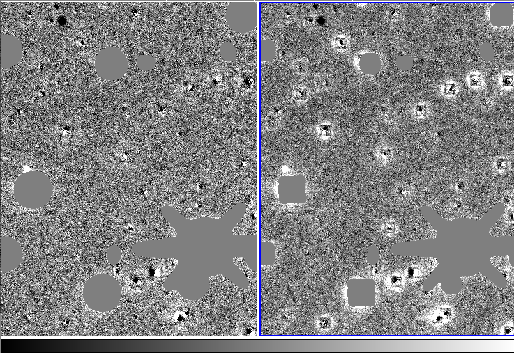

###############
Photpipe Stages
###############

*********
MKSATMASK
*********

``MKSATMASK`` takes as input the flattened image, and creates masks that mask out saturated stars and their spikes.

For light echoes, we use aggressive masking in order to get rid of 'halos' around the saturated stars. ::

	# For all saturated stars with # of saturated pixels Nsat greater than
	# MSM_MIN_NSAT and smaller than MSM_MAX_NSAT, a disk with radius
	# r_mask=(r*MSM_RADIUSSCALE)^MSM_RADIUSSCALEEXPONENT (centered at the
	# star) is masked with Nsat=pi*r^2.
	# r_mask' = sqrt(r_mask^2 + MSM_MINRADIUS^2)
	# MSM_MIN_NSAT, MSM_MAX_NSAT are optional
	MSM_RADIUSSCALE 4.0
	MSM_RADIUSSCALEEXPONENT 0.5
	MSM_MINRADIUS 3.5
	MSM_MIN_NSAT 1
	MSM_MAX_NSAT
	# if MSM_SCALEWITHFWHM>0.0, then r_mask is also scaled by the fwhm (where the
	# fwhm is in in pixels):
	# r_mask''=r_mask'*(fwhm/MSM_SCALEWITHFWHM)^MSM_SCALEWITHFWHMEXPONENT
	MSM_SCALEWITHFWHM 0.7
	MSM_SCALEWITHFWHMEXPONENT 0.7

******
DOPHOT
******

``DOPHOT`` is one of the photometry packages that has its own stage. After ``DOPHOT`` is run, the C-code 'cleanim' converts its output into a standardized format ('cmp' files) that photpipe understands. 

**cleanim and cmp file format**

The C-code 'cleanim' converts output from DOPHOT, DAOPHOT, and Sextractor into a common format: The fits header of the fits file on which the photometry package was run on is copied, and then an ASCII table contains the detection. Ouch. That format is a legacy format and really ugly, but it works, and it would take time and effort to change it now. As following stages like ABSPHOT are run, fits keys like ZPTMAG are added to the fits header.

Here are the columns of the ASCII table: ::

	COLTBL1 = 'Xpos              ' / X position

	COLTBL2 = 'Ypos              ' / Y position

	COLTBL3 = 'M                 ' / PSF fitted instrumental magnitude (m=-2.5*log10(flux))

	COLTBL4 = 'dM                ' / Error in M

	COLTBL5 = 'flux              ' / flux in counts

	COLTBL6 = 'dflux             ' / error in flux

	COLTBL7 = 'type              ' / Type of object, as defined by dophot (1=stellar, 2=extended, 3=double star, 7=low S/N thus less free parameter fit, everything else is crap)

	COLTBL8 = 'peakflux          ' / peakflux of fit

	COLTBL9 = 'sigx              ' / sigx of fit, as defined by dophot

	COLTBL10= 'sigxy             ' / sigxy of fit, as defined by dophot

	COLTBL11= 'sigy              ' / sigy of fit, as defined by dophot

	COLTBL12= 'sky               ' /

	COLTBL13= 'chisqr            ' / chisqr of object

	COLTBL14= 'class             ' / Classification of object, as defined by Sextra

	COLTBL15= 'FWHM1             ' / FWHM along minor axis

	COLTBL16= 'FWHM2             ' / FWHM along major axis

	COLTBL17= 'FWHM              ' / FWHM

	COLTBL18= 'angle             ' / Position angle

	COLTBL19= 'extendedness      ' / Extendedness parameter (dophot)

	COLTBL20= 'flag              ' / flags set by cleanim (hexadecimal), 0x1:at least 1 pixel within aperture of size defined by CMP_APERTURESIZE*FWHM, 0x8: central pixel of fit is masked

	COLTBL21= 'mask              ' / masks within aperture: all masks from the mask file within the aperture are 'or'ed.

	COLTBL22= 'Nmask             ' / # masked pixels within aperture of size defined by CMP_APERTURESIZE*FWHM

	COLTBL23= 'RA                ' / RA of object in deg (this was added by Will and Brian, but is not used anymore and set to 0)

	COLTBL24= 'Dec               ' / Dec of object in deg (this was added by Will and Brian, but is not used anymore and set to 0)

For difference imaging, after the 'pixchk' stage is done, the follwoing additional columns are added: ::

	COLTBL25= 'pixchk_Npos       ' / pixchk: # of positive pixels within Aperture

	COLTBL26= 'pixchk_Nneg       ' / pixchk: # of negative pixels within Aperture

	COLTBL27= 'pixchk_Nmask      ' / pixchk: # of masked pixels within Aperture

	COLTBL28= 'pixchk_Ntot       ' / pixchk: total # of pixels within Aperture

	COLTBL29= 'pixchk_Fpos       ' / pixchk: positive flux within Aperture

	COLTBL30= 'pixchk_Fneg       ' / pixchk: negative flux within Aperture

Similarly, ``DAOPHOT`` and Sextractor output is also converted into cmp files

******
WCSNON
******

This stage uses the IRAF msccmatch routine to determine the WCS solution of a given image. The output is in TNX format. It can use the WCS info already in the header, but in general we determine the distortion terms from a crowded field with msctpeak and feed it to the header of the fits file.

**IRAF msccmatch primer**

In the pipeline, we have an ugly perl wrapper around msccmatch: msccmatchIRAF.pl. It dates back to 2001 (ouch). msccmatch.pl uses an msccmatch parameter file defined in pipeline.params with WCSNON_PARAMFILE. By default, it points to msccmatch.params in the config dir. in this config dir, the most important msccmatch parameters are defined. From IRAF help:

- nsearch: Maximum number of positions to use in search. If this is zero then the coarse search is skipped and the coordinates are assumed to be close enough to centroid directly on the objects. If the coarse search is selected then this number should not be too large, otherwise the execution time will become long.
- search: Translation search radius in arcsec.If this is zero then the coarse serach is skipped and the coordinates are assumed to be close enough to centroid directly. This defines how far from the initial coordinates to search using the nsearch objects. It should be just large enough to include the expected error in the initial coordinates.
- rsearch: Rotation  search  radius  in  degrees.   This defines a range of rotations about the current tangent point that might  be  needed to  find  the correlation match.  The correlation algorithm only works with small rotations or order a degree.
- rms: The maximum RMS in arcsec for an acceptable solution.
- maxshift: Maximum centering shift in arcsec when centroiding. Sources that  produce  centroids (from the center task) that differ from the initial position by more than this amount are considered to have failed to be centroided.

nsearch is set by ``MSCC_NSEARCH``.

For a first coarse fit, it uses (search, rsearch, rms, maxshift) defined with ``MSCC_MSCCMATCH_PARAMSET_1``

``MSCC_MSCCMATCH_PARAMSET_1``     40.0,0.50,5.0,3.0

If that fit is successful, it uses ``MSCC_MSCCMATCH_PARAMSET_2`` for a second finetuning.

``MSCC_MSCCMATCH_PARAMSET_2``     0.0,0.03,0.15,1.0

**Fixing WCSNON failures**

IRAF's msccmatch does work in general well. However, the success is somewhat dependent on offset in the intial solution and the search parameters. The good news is that there is a relative easy way to fix any failures directly from the photpipe command line.

look at the results with: ::

	pipeview.pl -red ut130301 1 -stage WCSNON -wcs

this shows the table below with the listed columns:
- ``WCSFLAG``: ``WCSFLAG=1`` if WCS determination was successful
- ``NASTRO``: # of stars used for WCS solution
- ``EWCSXAS``: rms of positional differences of image detections to catalog position in arcsec in x-direction. For 2MASS:
	- Values <0.1 are excellent, only in good conditions and good non-linear distortion terms.
	- Values <0.2 are ok.
	- Values >0.25 need to be checked if ok (bad seeing and or telescope jump can cause values between 0.25 and 0.35 and still good WCS)
	- Values >0.35: Only very rarely is the WCS ok
- The typical default value for the rms cut is 0.25 (default set in msccmatch.params: ``MSCC_MAXRMSERROR``. This is overridden by ``WCSNON_RMSMAX`` in pipeline.params)
- ``EWCSYAS``: in y direction
- ``WCSRASH0``, ``WCSDESH0``: True shift in Ra, Dec position from original to final solution
- ``WCSRASH``, ``WCSDECSH``: Shift in Ra, Dec position directly taken from msccmatch. These are only different from ``WCSRASH0``, ``WCSDESH0`` if ``WCSNON_RADECSHIFT`` was used to shift the initial RA,DEC before msccmatch (see disussion below about ``WCSNON_RADECSHIFT``)
- ``WCSRAD``: search radius passed to msccmatch (default set in msccmatch.params: first number of ``MSCCMATCH_PARAMSET_1``. This can be overridden in pipeline.params with ``WCSNON_SEARCHRAD`` or in the command line, see below)
- WCSRADEC: initial RA,DEC shift forced by WCSNON_RADECSHIFT (see below)
- WCSCAT: astrometric catalog used
- WCSDB: nonlinear distortion terms used ::

	FILENAME                            WCSFLAG NASTRO EWCSXAS EWCSYAS WCSRASH0 WCSDESH0 WCSRASH WCSDECSH WCSRAD   WCSRADEC       WCSCAT WCSDB
	antlia1.i.ut130301.055392_1               1    243   0.187   0.166      1.1     21.3     1.1     21.3     40       NONE   WEB2MASS_J 2012-10-02.ec0915.i.ut121123.027739.1.db 
	antlia1.i.ut130301.055395_1               1    243   0.191   0.163      1.3     22.2     1.3     22.2     40       NONE   WEB2MASS_J 2012-10-02.ec0915.i.ut121123.027739.1.db 
	antlia1.i.ut130301.055476_1               1    243   0.198   0.179    -37.6     13.2   -37.6     13.2     40       NONE   WEB2MASS_J 2012-10-02.ec0915.i.ut121123.027739.1.db 
	antlia1.i.ut130301.055479_1               1    236   0.189   0.165    -37.5     13.4   -37.5     13.4     40       NONE   WEB2MASS_J 2012-10-02.ec0915.i.ut121123.027739.1.db 
	antlia1.r.ut130301.055389_1               1    238   0.200   0.158     60.6     64.1    60.6     64.1     40       NONE   WEB2MASS_J 2012-10-02.ec0915.i.ut121123.027739.1.db 
	antlia1.r.ut130301.055390_1               1    223   0.178   0.186     61.7     64.1    61.7     64.1     40       NONE   WEB2MASS_J 2012-10-02.ec0915.i.ut121123.027739.1.db 
	antlia1.r.ut130301.055391_1               1    225   0.171   0.166      1.6     21.4     1.6     21.4     40       NONE   WEB2MASS_J 2012-10-02.ec0915.i.ut121123.027739.1.db 
	antlia1.z.ut130301.055393_1               1    243   0.180   0.162      1.3     21.3     1.3     21.3     40       NONE   WEB2MASS_J 2012-10-02.ec0915.i.ut121123.027739.1.db 
	antlia1.z.ut130301.055394_1               1    243   0.191   0.166      1.4     22.1     1.4     22.1     40       NONE   WEB2MASS_J 2012-10-02.ec0915.i.ut121123.027739.1.db 
	antlia1.z.ut130301.055477_1               1    243   0.188   0.177    -36.9     13.2   -36.9     13.2     40       NONE   WEB2MASS_J 2012-10-02.ec0915.i.ut121123.027739.1.db 
	antlia1.z.ut130301.055478_1               1    237   0.193   0.167    -36.8     13.7   -36.8     13.7     40       NONE   WEB2MASS_J 2012-10-02.ec0915.i.ut121123.027739.1.db 
	antlia10.i.ut130301.055432_1              1    275   0.183   0.135    -21.2      8.1   -21.2      8.1     40       NONE   WEB2MASS_J 2012-10-02.ec0915.i.ut121123.027739.1.db 
	antlia10.i.ut130301.055435_1              1    273   0.188   0.140    -22.0      9.1   -22.0      9.1     40       NONE   WEB2MASS_J 2012-10-02.ec0915.i.ut121123.027739.1.db 
	antlia10.i.ut130301.055516_1              1    274   0.173   0.134    -28.3     18.7   -28.3     18.7     40       NONE   WEB2MASS_J 2012-10-02.ec0915.i.ut121123.027739.1.db 
	antlia10.i.ut130301.055519_1              1    270   0.170   0.129    -29.1     18.1   -29.1     18.1     40       NONE   WEB2MASS_J 2012-10-02.ec0915.i.ut121123.027739.1.db 
	antlia10.z.ut130301.055433_1              0     89   0.226   0.549    -21.7      6.0   -21.7      6.0     40       NONE   WEB2MASS_J 2012-10-02.ec0915.i.ut121123.027739.1.db 
	antlia10.z.ut130301.055434_1              1    273   0.182   0.144    -21.9     10.1   -21.9     10.1     40       NONE   WEB2MASS_J 2012-10-02.ec0915.i.ut121123.027739.1.db 
	antlia10.z.ut130301.055517_1              1    275   0.157   0.130    -28.5     18.6   -28.5     18.6     40       NONE   WEB2MASS_J 2012-10-02.ec0915.i.ut121123.027739.1.db 
	antlia10.z.ut130301.055518_1              1    271   0.174   0.133    -28.9     18.3   -28.9     18.3     40       NONE   WEB2MASS_J 2012-10-02.ec0915.i.ut121123.027739.1.db 
	antlia11.i.ut130301.055436_1              1    261   0.147   0.145    -28.0      0.8   -28.0      0.8     40       NONE   WEB2MASS_J 2012-10-02.ec0915.i.ut121123.027739.1.db 
	antlia11.i.ut130301.055439_1              1    260   0.173   0.151    -29.1     -0.4   -29.1     -0.4     40       NONE   WEB2MASS_J 2012-10-02.ec0915.i.ut121123.027739.1.db 
	antlia11.i.ut130301.055520_1              1    261   0.139   0.147    -16.4     17.0   -16.4     17.0     40       NONE   WEB2MASS_J 2012-10-02.ec0915.i.ut121123.027739.1.db 
	antlia11.i.ut130301.055523_1              1    262   0.148   0.148    -16.7     16.6   -16.7     16.6     40       NONE   WEB2MASS_J 2012-10-02.ec0915.i.ut121123.027739.1.db 
	antlia11.z.ut130301.055437_1              1    262   0.143   0.151    -28.2      0.5   -28.2      0.5     40       NONE   WEB2MASS_J 2012-10-02.ec0915.i.ut121123.027739.1.db 
	antlia11.z.ut130301.055438_1              1    261   0.149   0.149    -28.7     -0.3   -28.7     -0.3     40       NONE   WEB2MASS_J 2012-10-02.ec0915.i.ut121123.027739.1.db 
	antlia11.z.ut130301.055521_1              1    260   0.139   0.149    -16.7     16.7   -16.7     16.7     40       NONE   WEB2MASS_J 2012-10-02.ec0915.i.ut121123.027739.1.db 
	antlia11.z.ut130301.055522_1              1    263   0.146   0.151    -16.9     15.9   -16.9     15.9     40       NONE   WEB2MASS_J 2012-10-02.ec0915.i.ut121123.027739.1.db 
	antlia12.i.ut130301.055440_1              1    289   0.164   0.139    -34.0     -3.7   -34.0     -3.7     40       NONE   WEB2MASS_J 2012-10-02.ec0915.i.ut121123.027739.1.db 
	antlia12.i.ut130301.055443_1              1    288   0.156   0.142    -34.0     -4.6   -34.0     -4.6     40       NONE   WEB2MASS_J 2012-10-02.ec0915.i.ut121123.027739.1.db 
	antlia12.i.ut130301.055524_1              1    285   0.157   0.134    -20.4     18.1   -20.4     18.1     40       NONE   WEB2MASS_J 2012-10-02.ec0915.i.ut121123.027739.1.db 
	antlia12.i.ut130301.055527_1              1    287   0.153   0.139    -20.4     17.9   -20.4     17.9     40       NONE   WEB2MASS_J 2012-10-02.ec0915.i.ut121123.027739.1.db 
	antlia12.z.ut130301.055441_1              1    290   0.158   0.138    -33.5     -3.9   -33.5     -3.9     40       NONE   WEB2MASS_J 2012-10-02.ec0915.i.ut121123.027739.1.db 
	antlia12.z.ut130301.055442_1              1    289   0.150   0.139    -34.0     -4.3   -34.0     -4.3     40       NONE   WEB2MASS_J 2012-10-02.ec0915.i.ut121123.027739.1.db 
	antlia12.z.ut130301.055525_1              1    285   0.160   0.136    -20.0     18.0   -20.0     18.0     40       NONE   WEB2MASS_J 2012-10-02.ec0915.i.ut121123.027739.1.db 
	antlia12.z.ut130301.055526_1              1    287   0.157   0.141    -20.3     18.1   -20.3     18.1     40       NONE   WEB2MASS_J 2012-10-02.ec0915.i.ut121123.027739.1.db 
	antlia13.i.ut130301.055456_1              1    175   0.167   0.134    -36.6     -2.6   -36.6     -2.6     40       NONE   WEB2MASS_J 2012-10-02.ec0915.i.ut121123.027739.1.db 
	antlia13.i.ut130301.055459_1              1    177   0.192   0.133    -36.2     -3.1   -36.2     -3.1     40       NONE   WEB2MASS_J 2012-10-02.ec0915.i.ut121123.027739.1.db 
	antlia13.i.ut130301.055540_1              1    112   0.175   0.136    -26.6     26.6   -26.6     26.6     40       NONE   WEB2MASS_J 2012-10-02.ec0915.i.ut121123.027739.1.db 
	antlia13.i.ut130301.055543_1              1    178   0.174   0.131    -26.4     26.1   -26.4     26.1     40       NONE   WEB2MASS_J 2012-10-02.ec0915.i.ut121123.027739.1.db 
	antlia13.z.ut130301.055457_1              1    175   0.164   0.134    -36.3     -2.7   -36.3     -2.7     40       NONE   WEB2MASS_J 2012-10-02.ec0915.i.ut121123.027739.1.db 
	antlia13.z.ut130301.055458_1              1    179   0.185   0.134    -36.4     -2.9   -36.4     -2.9     40       NONE   WEB2MASS_J 2012-10-02.ec0915.i.ut121123.027739.1.db 
	antlia13.z.ut130301.055541_1              1    171   0.170   0.132    -26.4     25.9   -26.4     25.9     40       NONE   WEB2MASS_J 2012-10-02.ec0915.i.ut121123.027739.1.db 
	antlia13.z.ut130301.055542_1              1    179   0.169   0.130    -26.2     26.5   -26.2     26.5     40       NONE   WEB2MASS_J 2012-10-02.ec0915.i.ut121123.027739.1.db 
	antlia14.i.ut130301.055452_1              1    212   0.194   0.143    -35.6     -1.8   -35.6     -1.8     40       NONE   WEB2MASS_J 2012-10-02.ec0915.i.ut121123.027739.1.db 
	antlia14.i.ut130301.055455_1              1    220   0.196   0.133    -35.0     -2.2   -35.0     -2.2     40       NONE   WEB2MASS_J 2012-10-02.ec0915.i.ut121123.027739.1.db 
	antlia14.i.ut130301.055536_1              1    215   0.193   0.146    -27.2     19.4   -27.2     19.4     40       NONE   WEB2MASS_J 2012-10-02.ec0915.i.ut121123.027739.1.db 
	antlia14.i.ut130301.055539_1              1    211   0.195   0.138    -27.1     19.2   -27.1     19.2     40       NONE   WEB2MASS_J 2012-10-02.ec0915.i.ut121123.027739.1.db 
	antlia14.z.ut130301.055453_1              1    211   0.184   0.141    -35.1     -1.7   -35.1     -1.7     40       NONE   WEB2MASS_J 2012-10-02.ec0915.i.ut121123.027739.1.db 
	antlia14.z.ut130301.055454_1              1    219   0.189   0.137    -35.1     -2.1   -35.1     -2.1     40       NONE   WEB2MASS_J 2012-10-02.ec0915.i.ut121123.027739.1.db 
	antlia14.z.ut130301.055537_1              1    213   0.186   0.140    -26.8     19.1   -26.8     19.1     40       NONE   WEB2MASS_J 2012-10-02.ec0915.i.ut121123.027739.1.db 
	antlia14.z.ut130301.055538_1              1    210   0.187   0.132    -27.2     19.5   -27.2     19.5     40       NONE   WEB2MASS_J 2012-10-02.ec0915.i.ut121123.027739.1.db 
	antlia15.i.ut130301.055448_1              1    204   0.138   0.162    -34.7     -4.5   -34.7     -4.5     40       NONE   WEB2MASS_J 2012-10-02.ec0915.i.ut121123.027739.1.db 
	antlia15.i.ut130301.055451_1              1    219   0.146   0.140    -34.5     -5.2   -34.5     -5.2     40       NONE   WEB2MASS_J 2012-10-02.ec0915.i.ut121123.027739.1.db 
	antlia15.i.ut130301.055532_1              1    210   0.139   0.170    -23.1     15.7   -23.1     15.7     40       NONE   WEB2MASS_J 2012-10-02.ec0915.i.ut121123.027739.1.db 
	antlia15.i.ut130301.055535_1              1    208   0.144   0.137    -23.6     16.4   -23.6     16.4     40       NONE   WEB2MASS_J 2012-10-02.ec0915.i.ut121123.027739.1.db 
	antlia15.z.ut130301.055449_1              1    204   0.130   0.163    -34.2     -4.4   -34.2     -4.4     40       NONE   WEB2MASS_J 2012-10-02.ec0915.i.ut121123.027739.1.db 
	antlia15.z.ut130301.055450_1              1    218   0.145   0.144    -34.4     -5.0   -34.4     -5.0     40       NONE   WEB2MASS_J 2012-10-02.ec0915.i.ut121123.027739.1.db 
	antlia16.i.ut130301.055444_1              1    256   0.207   0.175    -33.9     -4.6   -33.9     -4.6     40       NONE   WEB2MASS_J 2012-10-02.ec0915.i.ut121123.027739.1.db 
	antlia16.i.ut130301.055447_1              1    253   0.209   0.188    -33.9     -4.8   -33.9     -4.8     40       NONE   WEB2MASS_J 2012-10-02.ec0915.i.ut121123.027739.1.db 
	antlia16.i.ut130301.055528_1              1    258   0.191   0.160    -19.6     16.4   -19.6     16.4     40       NONE   WEB2MASS_J 2012-10-02.ec0915.i.ut121123.027739.1.db 
	antlia16.i.ut130301.055531_1              1    248   0.191   0.176    -19.7     17.6   -19.7     17.6     40       NONE   WEB2MASS_J 2012-10-02.ec0915.i.ut121123.027739.1.db 
	antlia17.i.ut130301.055460_1              1    160   0.203   0.148    -14.2     23.9   -14.2     23.9     40       NONE   WEB2MASS_J 2012-10-02.ec0915.i.ut121123.027739.1.db 
	antlia17.i.ut130301.055463_1              1     57   0.178   0.155    -13.6     19.6   -13.6     19.6     40       NONE   WEB2MASS_J 2012-10-02.ec0915.i.ut121123.027739.1.db 
	antlia17.i.ut130301.055544_1              1    159   0.197   0.137    -26.1     27.0   -26.1     27.0     40       NONE   WEB2MASS_J 2012-10-02.ec0915.i.ut121123.027739.1.db 
	antlia17.i.ut130301.055547_1              1    155   0.193   0.150    -25.5     24.0   -25.5     24.0     40       NONE   WEB2MASS_J 2012-10-02.ec0915.i.ut121123.027739.1.db 
	antlia18.i.ut130301.055464_1              1    179   0.177   0.176    -19.1     18.5   -19.1     18.5     40       NONE   WEB2MASS_J 2012-10-02.ec0915.i.ut121123.027739.1.db 
	antlia18.i.ut130301.055467_1              1    170   0.172   0.171    -19.4     15.5   -19.4     15.5     40       NONE   WEB2MASS_J 2012-10-02.ec0915.i.ut121123.027739.1.db 
	antlia18.i.ut130301.055548_1              1    177   0.174   0.167    -30.9     17.6   -30.9     17.6     40       NONE   WEB2MASS_J 2012-10-02.ec0915.i.ut121123.027739.1.db 
	antlia18.i.ut130301.055551_1              1    172   0.174   0.171    -31.2     15.5   -31.2     15.5     40       NONE   WEB2MASS_J 2012-10-02.ec0915.i.ut121123.027739.1.db 
	antlia19.i.ut130301.055468_1              1    197   0.193   0.171    -25.3     13.4   -25.3     13.4     40       NONE   WEB2MASS_J 2012-10-02.ec0915.i.ut121123.027739.1.db 
	antlia19.i.ut130301.055471_1              1    190   0.185   0.164    -25.2     12.8   -25.2     12.8     40       NONE   WEB2MASS_J 2012-10-02.ec0915.i.ut121123.027739.1.db 
	antlia19.i.ut130301.055552_1              1    192   0.189   0.165    -14.6     19.5   -14.6     19.5     40       NONE   WEB2MASS_J 2012-10-02.ec0915.i.ut121123.027739.1.db 
	antlia19.i.ut130301.055555_1              1    195   0.181   0.168    -14.1     17.5   -14.1     17.5     40       NONE   WEB2MASS_J 2012-10-02.ec0915.i.ut121123.027739.1.db 
	antlia2.i.ut130301.055396_1               1    249   0.178   0.161     -3.1     18.3    -3.1     18.3     40       NONE   WEB2MASS_J 2012-10-02.ec0915.i.ut121123.027739.1.db 
	antlia2.i.ut130301.055399_1               1    225   0.188   0.163     -3.1     18.1    -3.1     18.1     40       NONE   WEB2MASS_J 2012-10-02.ec0915.i.ut121123.027739.1.db 
	antlia2.i.ut130301.055480_1               1    239   0.175   0.157    -18.4     13.6   -18.4     13.6     40       NONE   WEB2MASS_J 2012-10-02.ec0915.i.ut121123.027739.1.db 
	antlia2.i.ut130301.055483_1               1    223   0.185   0.163    -16.0     15.6   -16.0     15.6     40       NONE   WEB2MASS_J 2012-10-02.ec0915.i.ut121123.027739.1.db 
	antlia20.i.ut130301.055472_1              1    266   0.181   0.157    -30.7      5.1   -30.7      5.1     40       NONE   WEB2MASS_J 2012-10-02.ec0915.i.ut121123.027739.1.db 
	antlia20.i.ut130301.055475_1              1    270   0.179   0.153    -30.5      6.3   -30.5      6.3     40       NONE   WEB2MASS_J 2012-10-02.ec0915.i.ut121123.027739.1.db 
	antlia20.i.ut130301.055556_1              1    263   0.179   0.153    -16.0     17.7   -16.0     17.7     40       NONE   WEB2MASS_J 2012-10-02.ec0915.i.ut121123.027739.1.db 
	antlia20.i.ut130301.055559_1              1    272   0.175   0.155    -15.6     17.9   -15.6     17.9     40       NONE   WEB2MASS_J 2012-10-02.ec0915.i.ut121123.027739.1.db 
	antlia21.i.ut130301.055424_1              1    146   0.207   0.157    -15.9     13.5   -15.9     13.5     40       NONE   WEB2MASS_J 2012-10-02.ec0915.i.ut121123.027739.1.db 
	antlia21.i.ut130301.055427_1              1    154   0.197   0.164    -16.5     13.7   -16.5     13.7     40       NONE   WEB2MASS_J 2012-10-02.ec0915.i.ut121123.027739.1.db 
	antlia21.i.ut130301.055508_1              1    150   0.203   0.157    -26.3     20.7   -26.3     20.7     40       NONE   WEB2MASS_J 2012-10-02.ec0915.i.ut121123.027739.1.db 
	antlia21.i.ut130301.055511_1              1    158   0.189   0.155    -26.4     20.8   -26.4     20.8     40       NONE   WEB2MASS_J 2012-10-02.ec0915.i.ut121123.027739.1.db 
	antlia3.i.ut130301.055400_1               1    285   0.188   0.157     -7.0     14.8    -7.0     14.8     40       NONE   WEB2MASS_J 2012-10-02.ec0915.i.ut121123.027739.1.db 
	antlia3.i.ut130301.055403_1               1    291   0.185   0.160     -7.2     15.7    -7.2     15.7     40       NONE   WEB2MASS_J 2012-10-02.ec0915.i.ut121123.027739.1.db 
	antlia3.i.ut130301.055484_1               1    282   0.188   0.159    -22.6     11.8   -22.6     11.8     40       NONE   WEB2MASS_J 2012-10-02.ec0915.i.ut121123.027739.1.db 
	antlia3.i.ut130301.055487_1               1    291   0.178   0.160    -23.4     12.4   -23.4     12.4     40       NONE   WEB2MASS_J 2012-10-02.ec0915.i.ut121123.027739.1.db 
	antlia4.i.ut130301.055404_1               1    374   0.161   0.129    -13.0     10.6   -13.0     10.6     40       NONE   WEB2MASS_J 2012-10-02.ec0915.i.ut121123.027739.1.db 
	antlia4.i.ut130301.055407_1               1    363   0.156   0.127    -13.3     10.4   -13.3     10.4     40       NONE   WEB2MASS_J 2012-10-02.ec0915.i.ut121123.027739.1.db 
	antlia4.i.ut130301.055488_1               1    373   0.150   0.128    -23.3      8.7   -23.3      8.7     40       NONE   WEB2MASS_J 2012-10-02.ec0915.i.ut121123.027739.1.db 
	antlia4.i.ut130301.055491_1               1    364   0.153   0.135    -20.2     10.8   -20.2     10.8     40       NONE   WEB2MASS_J 2012-10-02.ec0915.i.ut121123.027739.1.db 
	antlia5.i.ut130301.055420_1               1    173   0.186   0.167    -14.8     14.2   -14.8     14.2     40       NONE   WEB2MASS_J 2012-10-02.ec0915.i.ut121123.027739.1.db 
	antlia5.i.ut130301.055423_1               1    173   0.178   0.140    -15.4     14.6   -15.4     14.6     40       NONE   WEB2MASS_J 2012-10-02.ec0915.i.ut121123.027739.1.db 
	antlia5.i.ut130301.055504_1               1    176   0.180   0.155    -23.3     20.7   -23.3     20.7     40       NONE   WEB2MASS_J 2012-10-02.ec0915.i.ut121123.027739.1.db 
	antlia5.i.ut130301.055507_1               1    173   0.177   0.145    -22.2     23.7   -22.2     23.7     40       NONE   WEB2MASS_J 2012-10-02.ec0915.i.ut121123.027739.1.db 
	antlia6.i.ut130301.055416_1               1    243   0.181   0.149    -12.6     14.8   -12.6     14.8     40       NONE   WEB2MASS_J 2012-10-02.ec0915.i.ut121123.027739.1.db 
	antlia6.i.ut130301.055419_1               1    248   0.174   0.154    -13.6     15.4   -13.6     15.4     40       NONE   WEB2MASS_J 2012-10-02.ec0915.i.ut121123.027739.1.db 
	antlia6.i.ut130301.055500_1               1    246   0.176   0.153    -22.2     17.2   -22.2     17.2     40       NONE   WEB2MASS_J 2012-10-02.ec0915.i.ut121123.027739.1.db 
	antlia6.i.ut130301.055503_1               1    250   0.174   0.154    -22.9     19.4   -22.9     19.4     40       NONE   WEB2MASS_J 2012-10-02.ec0915.i.ut121123.027739.1.db 
	antlia7.i.ut130301.055412_1               1    273   0.212   0.143    -12.8     12.3   -12.8     12.3     40       NONE   WEB2MASS_J 2012-10-02.ec0915.i.ut121123.027739.1.db 
	antlia7.i.ut130301.055415_1               1    247   0.211   0.161    -13.6     12.2   -13.6     12.2     40       NONE   WEB2MASS_J 2012-10-02.ec0915.i.ut121123.027739.1.db 
	antlia7.i.ut130301.055496_1               1    274   0.210   0.139    -21.6     14.1   -21.6     14.1     40       NONE   WEB2MASS_J 2012-10-02.ec0915.i.ut121123.027739.1.db 
	antlia7.i.ut130301.055499_1               1    250   0.209   0.175    -21.8     15.1   -21.8     15.1     40       NONE   WEB2MASS_J 2012-10-02.ec0915.i.ut121123.027739.1.db 
	antlia8.i.ut130301.055408_1               1    296   0.159   0.131    -13.6     11.0   -13.6     11.0     40       NONE   WEB2MASS_J 2012-10-02.ec0915.i.ut121123.027739.1.db 
	antlia8.i.ut130301.055411_1               1    299   0.174   0.166    -13.9     11.7   -13.9     11.7     40       NONE   WEB2MASS_J 2012-10-02.ec0915.i.ut121123.027739.1.db 
	antlia8.i.ut130301.055492_1               1    300   0.148   0.135    -24.3      9.5   -24.3      9.5     40       NONE   WEB2MASS_J 2012-10-02.ec0915.i.ut121123.027739.1.db 
	antlia8.i.ut130301.055495_1               1    302   0.166   0.153    -21.8     11.6   -21.8     11.6     40       NONE   WEB2MASS_J 2012-10-02.ec0915.i.ut121123.027739.1.db 
	antlia9.i.ut130301.055428_1               1    187   0.166   0.157    -17.9     10.1   -17.9     10.1     40       NONE   WEB2MASS_J 2012-10-02.ec0915.i.ut121123.027739.1.db 
	antlia9.i.ut130301.055431_1               1    194   0.162   0.153    -18.5     10.2   -18.5     10.2     40       NONE   WEB2MASS_J 2012-10-02.ec0915.i.ut121123.027739.1.db 
	antlia9.i.ut130301.055512_1               1    188   0.156   0.160    -24.9     20.3   -24.9     20.3     40       NONE   WEB2MASS_J 2012-10-02.ec0915.i.ut121123.027739.1.db 
	antlia9.i.ut130301.055515_1               1    189   0.153   0.133    -25.2     20.9   -25.2     20.9     40       NONE   WEB2MASS_J 2012-10-02.ec0915.i.ut121123.027739.1.db 
	bright_star.r.ut130301.055370_1           0      0   0.000   0.000      0.0      0.0     0.0      0.0      0       NONE   WEB2MASS_J 2012-10-02.ec0915.i.ut121123.027739.1.db 
	bright_star.r.ut130301.055371_1           0      0   0.000   0.000      0.0      0.0     0.0      0.0      0       NONE   WEB2MASS_J 2012-10-02.ec0915.i.ut121123.027739.1.db 
	bright_star.r.ut130301.055372_1           1    160   0.127   0.193      4.3     28.4     4.3     28.4     40       NONE   WEB2MASS_J 2012-10-02.ec0915.i.ut121123.027739.1.db 
	bright_star.r.ut130301.055373_1           1    162   0.124   0.189     -8.2     28.0    -8.2     28.0     40       NONE   WEB2MASS_J 2012-10-02.ec0915.i.ut121123.027739.1.db 
	centaurus5.i.ut130301.055560_1            1    339   0.185   0.151      3.3      5.4     3.3      5.4     40       NONE   WEB2MASS_J 2012-10-02.ec0915.i.ut121123.027739.1.db 
	centaurus5.i.ut130301.055563_1            1    341   0.170   0.146      5.0      5.3     5.0      5.3     40       NONE   WEB2MASS_J 2012-10-02.ec0915.i.ut121123.027739.1.db 
	e2_a.g.ut130301.055378_1                  0     66   0.174   0.253    -35.6     34.4   -35.6     34.4     40       NONE   WEB2MASS_J 2012-10-02.ec0915.i.ut121123.027739.1.db 
	e2_a.i.ut130301.055376_1                  0     86   0.183   0.258    -36.0     34.6   -36.0     34.6     40       NONE   WEB2MASS_J 2012-10-02.ec0915.i.ut121123.027739.1.db 
	e2_a.r.ut130301.055377_1                  0     84   0.191   0.258    -35.8     34.5   -35.8     34.5     40       NONE   WEB2MASS_J 2012-10-02.ec0915.i.ut121123.027739.1.db 
	e3_a.g.ut130301.055383_1                  1    183   0.149   0.136     -8.9     13.3    -8.9     13.3     40       NONE   WEB2MASS_J 2012-10-02.ec0915.i.ut121123.027739.1.db 
	e3_a.i.ut130301.055381_1                  1    198   0.141   0.145     -8.9     13.6    -8.9     13.6     40       NONE   WEB2MASS_J 2012-10-02.ec0915.i.ut121123.027739.1.db 
	e3_a.r.ut130301.055382_1                  1    198   0.138   0.136     -9.0     13.4    -9.0     13.4     40       NONE   WEB2MASS_J 2012-10-02.ec0915.i.ut121123.027739.1.db 
	e3_a.z.ut130301.055380_1                  1    198   0.137   0.138     -8.9     13.2    -8.9     13.2     40       NONE   WEB2MASS_J 2012-10-02.ec0915.i.ut121123.027739.1.db 
	e5_a.g.ut130301.055626_1                  0      0   0.000   0.000      0.0      0.0     0.0      0.0      0       NONE   WEB2MASS_J 2012-10-02.ec0915.i.ut121123.027739.1.db 
	e5_a.i.ut130301.055628_1                  1    391   0.146   0.147    -77.4      8.2   -77.4      8.2     40       NONE   WEB2MASS_J 2012-10-02.ec0915.i.ut121123.027739.1.db 
	e5_a.r.ut130301.055627_1                  1    388   0.163   0.146    -77.0      8.3   -77.0      8.3     40       NONE   WEB2MASS_J 2012-10-02.ec0915.i.ut121123.027739.1.db 
	e6_a.g.ut130301.055616_1                  0      0   0.000   0.000      0.0      0.0     0.0      0.0      0       NONE   WEB2MASS_J 2012-10-02.ec0915.i.ut121123.027739.1.db 
	e6_a.i.ut130301.055618_1                  1    890   0.151   0.137    -41.7    -21.2   -41.7    -21.2     40       NONE   WEB2MASS_J 2012-10-02.ec0915.i.ut121123.027739.1.db 
	e6_a.r.ut130301.055617_1                  0      0   0.000   0.000      0.0      0.0     0.0      0.0      0       NONE   WEB2MASS_J 2012-10-02.ec0915.i.ut121123.027739.1.db 
	sdssj0843_0000.g.ut130301.055388_1        0      0   0.000   0.000      0.0      0.0     0.0      0.0      0       NONE   WEB2MASS_J 2012-10-02.ec0915.i.ut121123.027739.1.db 
	sdssj0843_0000.i.ut130301.055386_1        0      0   0.000   0.000      0.0      0.0     0.0      0.0      0       NONE   WEB2MASS_J 2012-10-02.ec0915.i.ut121123.027739.1.db 
	sdssj0843_0000.r.ut130301.055387_1        0      0   0.000   0.000      0.0      0.0     0.0      0.0      0       NONE   WEB2MASS_J 2012-10-02.ec0915.i.ut121123.027739.1.db 
	sdssj0843_0000.z.ut130301.055385_1        0      0   0.000   0.000      0.0      0.0     0.0      0.0      0       NONE   WEB2MASS_J 2012-10-02.ec0915.i.ut121123.027739.1.db 
	sdssj1442_0005.g.ut130301.055621_1        0      0   0.000   0.000      0.0      0.0     0.0      0.0      0       NONE   WEB2MASS_J 2012-10-02.ec0915.i.ut121123.027739.1.db 
	sdssj1442_0005.i.ut130301.055623_1        0      0   0.000   0.000      0.0      0.0     0.0      0.0      0       NONE   WEB2MASS_J 2012-10-02.ec0915.i.ut121123.027739.1.db 
	sdssj1442_0005.r.ut130301.055622_1        0      0   0.000   0.000      0.0      0.0     0.0      0.0      0       NONE   WEB2MASS_J 2012-10-02.ec0915.i.ut121123.027739.1.db 
	sdssj1442_0005.z.ut130301.055624_1        1     82   0.199   0.245    -49.3     29.0   -49.3     29.0     40       NONE   WEB2MASS_J 2012-10-02.ec0915.i.ut121123.027739.1.db 

You see above that for images that are close in time and position, the ``WCSRASH0``, ``WCSDESH0`` are very similar. This is what you can use to fix the images that did not pass: If the search radius (``WCSRAD``above) is much smaller than ``WCSRASH`` and ``WCSDESH``, then it will fail. It's somewhat mysterious how the search radius works in msccmatch. If the search radius is too different from the shift (including too small!), it fails.  So a search radius of 40 arcsec is a good start, 60-80 if the pointing is a little off. If the search radius is very big (>120), then it takes a long time, and fails sometimes for no good reason. Therefore the best thing to do is to shift the WCS in the image so that the shift done by msccmatch is small. If you don't know the shift, then increase the search radius

Let's look at sdssj1442_0005 as an example: One image passed, with pretty large ``WCSRASH``, ``WCSDESH``. There are two possibilities to try to fix the rest of the images of that field, described below, and sometimes you have to use a combination of them.

*Option #1*: shift the RA,DEC based on what the ``WCSRASH0``, ``WCSDESH0`` of the image that passed is. This assumes that the shifts are similar since it is a similar pointing and close in time. ::

	pipeloop.pl -red ut130301 1 -stage FLATTEN,WCSNON -im sdssj1442 -redobad -id 055621-55624 -k WCSNON_RADECSHIFT -50,30

- why FLATTEN? Because then the image is again pristine since it is reduced again and the old copy is overwritten (Note: if IMAGES_ALREADY_CALIBRATED=1, then a soft link from workspace to rawdata image is done, and then it is not pristine!), and not changed in any way from the failed msccmatch attempt. You don't have to do this, but sometimes msccmatch does funky things.
- how does the pipeline know which images to flatten again with 
- redobad, even though all of them passed FLATTEN
before? check out the stages.init file: ::

	FLATTEN   flatten   CREATECALS,NOT_WCSNON,NOT_WCSLIN        0

You have ``CREATECALS`` as the usual input for ``FLATTEN``, but you also have ``NOT_STAGE`` (``STAGE WCSNON`` or ``WCSLIN``), which feeds into the stage all entries that did not pass the stage ``STAGE``. This allows it to use the -redobad option in cases like that!

For some IRAF versions, there is a bug in msccmatch, which gives ERROR: floating point overflow, which can be fixed following the instructions here

So let's see what we got: ::

	pipeview.pl -red ut130301 1 -stage WCSNON -wcs -im sdssj1442
	FILENAME                            WCSFLAG NASTRO EWCSXAS EWCSYAS WCSRASH0 WCSDESH0 WCSRASH WCSDECSH WCSRAD   WCSRADEC       WCSCAT WCSDB 
	sdssj1442_0005.g.ut130301.055621_1        0      0   0.000   0.000      0.0      0.0     0.0      0.0      0       NONE   WEB2MASS_J 2012-10-02.ec0915.i.ut121123.027739.1.db 
	sdssj1442_0005.i.ut130301.055623_1        1     81   0.201   0.235    -48.4     24.2     1.6     -5.8     40     -50,30   WEB2MASS_J 2012-10-02.ec0915.i.ut121123.027739.1.db 
	sdssj1442_0005.r.ut130301.055622_1        0      0   0.000   0.000      0.0      0.0     0.0      0.0      0       NONE   WEB2MASS_J 2012-10-02.ec0915.i.ut121123.027739.1.db 
	sdssj1442_0005.z.ut130301.055624_1        1     82   0.199   0.245    -49.3     29.0   -49.3     29.0     40       NONE   WEB2MASS_J 2012-10-02.ec0915.i.ut121123.027739.1.db 

One more image passed. Note that (``WCSRASH0``,``WCSDESH0``) =  ``WCSRADEC`` + (``WCSRASH``,``WCSDECSH``). So always use (``WCSRASH0``,``WCSDESH0``) for ``WCSNON_RADECSHIFT``, and not (``WCSRASH``,``WCSDECSH``)

Let's play around with ``WCSNON_SEARCHRAD``: :: 

	pipeloop.pl -red ut130301 1 -stage FLATTEN,WCSNON -im sdssj1442 -redobad -id 055621-55624 -k WCSNON_RADECSHIFT -50,30 -k WCSNON_SEARCHRAD 10

Failed with: ::

	ms> ms> ms> ms> ms> ms> ms> ms> ms> ms> ms> ms> ms> ms> ms> ms> ms> ms> ms> ms> ms> MSCCMATCH:
  sdssj1442_0005.r.ut130301.055622_1.fits:
    320 input coordinates
    237/320 coordinates out of bounds
    search using up to 1000 objects:
    search using up to 1000 objects:
	Warning: Automatic search failed

That is the worst since it gives no indication what the real problem is. Then you need: 

*Option #2*: no shift but large search radius: ::

	pipeloop.pl -red ut130301 1 -stage FLATTEN,WCSNON -im sdssj1442 -redobad -id 055621-55624 -k WCSNON_SEARCHRAD 80

fails again.
This is where you look at the image that failed, and the one that did not fail.::

	ds9mark.pl sdssj1442_0005.z.ut130301.055624_1.fits sdssj1442_0005.z.ut130301.055624_1.WEB2MASS_J &
	ds9mark.pl sdssj1442_0005.r.ut130301.055622_1.fits sdssj1442_0005.r.ut130301.055622_1.WEB2MASS_J &

Now you can see if the astrometric catalog halfway matches the objects in the image that failed, and in this case it is not clear why it doesn't work.

Ok, slightly different shift, trying again: ::

	pipeloop.pl -red ut130301 1 -stage FLATTEN,WCSNON -im sdssj1442 -redobad -id  055621-55624 -k WCSNON_RADECSHIFT -40,25 -k WCSNON_SEARCHRAD 25

still doesn't work.

desparation move: large search radius for good shift: ::

	pipeloop.pl -red ut130301 1 -stage FLATTEN,WCSNON -im sdssj1442 -redobad -id  055621-55624 -k WCSNON_RADECSHIFT -40,25 -k WCSNON_SEARCHRAD 80

now one image worked! ::

	FILENAME                            WCSFLAG NASTRO EWCSXAS EWCSYAS WCSRASH0 WCSDESH0 WCSRASH WCSDECSH WCSRAD   WCSRADEC       WCSCAT WCSDB 
	sdssj1442_0005.g.ut130301.055621_1        0      0   0.000   0.000      0.0      0.0     0.0      0.0      0       NONE   WEB2MASS_J 2012-10-02.ec0915.i.ut121123.027739.1.db 
	sdssj1442_0005.i.ut130301.055623_1        1     81   0.201   0.235    -48.4     24.2     1.6     -5.8     40     -50,30   WEB2MASS_J 2012-10-02.ec0915.i.ut121123.027739.1.db 
	sdssj1442_0005.r.ut130301.055622_1        1     80   0.223   0.228    -48.4     22.1    -8.4     -2.9     80     -40,25   WEB2MASS_J 2012-10-02.ec0915.i.ut121123.027739.1.db 
	sdssj1442_0005.z.ut130301.055624_1        1     82   0.199   0.245    -49.3     29.0   -49.3     29.0     40       NONE   WEB2MASS_J 2012-10-02.ec0915.i.ut121123.027739.1.db 

So this is vintage msccmatch: there are rules, but they never apply 100% of the time. Here the large search radius should have made it more difficult to find the solution since the shift was close! ok, since g band is not so well matched to 2MASS, let's put up an upper mag limit on 2MASS catalog: ::

	pipeloop.pl -red ut130301 1 -stage FLATTEN,WCSNON -im sdssj1442 -redobad -id  055621-55624 -k WCSNON_RADECSHIFT -40,25 -k WCSNON_SEARCHRAD 25 -k  WCSNON_CAT_MAXMAG 14.2
	FILENAME                            WCSFLAG NASTRO EWCSXAS EWCSYAS WCSRASH0 WCSDESH0 WCSRASH WCSDECSH WCSRAD   WCSRADEC       WCSCAT WCSDB 
	sdssj1442_0005.g.ut130301.055621_1        0      6   0.386   0.501    -52.9     31.1   -12.9      6.2     25     -40,25   WEB2MASS_J 2012-10-02.ec0915.i.ut121123.027739.1.db 
	sdssj1442_0005.i.ut130301.055623_1        1     81   0.201   0.235    -48.4     24.2     1.6     -5.8     40     -50,30   WEB2MASS_J 2012-10-02.ec0915.i.ut121123.027739.1.db 
	sdssj1442_0005.r.ut130301.055622_1        1     80   0.223   0.228    -48.4     22.1    -8.4     -2.9     80     -40,25   WEB2MASS_J 2012-10-02.ec0915.i.ut121123.027739.1.db 
	sdssj1442_0005.z.ut130301.055624_1        1     82   0.199   0.245    -49.3     29.0   -49.3     29.0     40       NONE   WEB2MASS_J 2012-10-02.ec0915.i.ut121123.027739.1.db

So ``WCSFLAG=0``, it failed, but it failed more graceful than before, and we can see the values for ``EWCSXAS EWCSYAS WCSRASH0 WCSDESH0`` etc. The ``EWCSXAS EWCSYAS`` are way too high, so rightfully failed. This is a tough one.

Ok, let's leave that one for now, and let's look at e2: ::

	FILENAME                            WCSFLAG NASTRO EWCSXAS EWCSYAS WCSRASH0 WCSDESH0 WCSRASH WCSDECSH WCSRAD   WCSRADEC       WCSCAT WCSDB 
	e2_a.g.ut130301.055378_1                  0     66   0.174   0.253    -35.6     34.4   -35.6     34.4     40       NONE   WEB2MASS_J 2012-10-02.ec0915.i.ut121123.027739.1.db 
	e2_a.i.ut130301.055376_1                  0     86   0.183   0.258    -36.0     34.6   -36.0     34.6     40       NONE   WEB2MASS_J 2012-10-02.ec0915.i.ut121123.027739.1.db 
	e2_a.r.ut130301.055377_1                  0     84   0.191   0.258    -35.8     34.5   -35.8     34.5     40       NONE   WEB2MASS_J 2012-10-02.ec0915.i.ut121123.027739.1.db 

These ones are good (same WCS*SH), probably bad asymmetric PSF. ::

	pipeloop.pl -red ut130301 1 -stage FLATTEN,WCSNON -im e2 -redobad   -k  WCSNON_RADECSHIFT  -35,35 -k WCSNON_SEARCHRAD 15 -k WCSNON_RMSMAX 0.27
	FILENAME                  WCSFLAG NASTRO EWCSXAS EWCSYAS WCSRASH0 WCSDESH0 WCSRASH WCSDECSH WCSRAD   WCSRADEC       WCSCAT WCSDB 
	e2_a.g.ut130301.055378_1        1     66   0.174   0.253    -35.7     34.4    -0.7     -0.6     15     -35,35   WEB2MASS_J 2012-10-02.ec0915.i.ut121123.027739.1.db 
	e2_a.i.ut130301.055376_1        1     86   0.183   0.258    -36.0     34.6    -1.1     -0.4     15     -35,35   WEB2MASS_J 2012-10-02.ec0915.i.ut121123.027739.1.db 
	e2_a.r.ut130301.055377_1        1     84   0.191   0.258    -35.8     34.5    -0.8     -0.5     15     -35,35   WEB2MASS_J 2012-10-02.ec0915.i.ut121123.027739.1.db 
	e2_a.z.ut130301.055375_1        1     85   0.195   0.265    -35.8     34.7    -0.8     -0.3     15     -35,35   WEB2MASS_J 2012-10-02.ec0915.i.ut121123.027739.1.db 

ok, worked! Let's look at: ::

	e5_a.g.ut130301.055626_1                  0      0   0.000   0.000      0.0      0.0     0.0      0.0      0       NONE   WEB2MASS_J 2012-10-02.ec0915.i.ut121123.027739.1.db 
	e5_a.i.ut130301.055628_1                  1    391   0.146   0.147    -77.4      8.2   -77.4      8.2     40       NONE   WEB2MASS_J 2012-10-02.ec0915.i.ut121123.027739.1.db 
	e5_a.r.ut130301.055627_1                  1    388   0.163   0.146    -77.0      8.3   -77.0      8.3     40       NONE   WEB2MASS_J 2012-10-02.ec0915.i.ut121123.027739.1.db 
	pipeloop.pl -red ut130301 1 -stage FLATTEN,WCSNON -im e5 -redobad   -k WCSNON_RADECSHIFT  -77,8 -k WCSNON_SEARCHRAD 15
	FILENAME                  WCSFLAG NASTRO EWCSXAS EWCSYAS WCSRASH0 WCSDESH0 WCSRASH WCSDECSH WCSRAD   WCSRADEC       WCSCAT WCSDB 
	e5_a.g.ut130301.055626_1        1    355   0.157   0.147    -76.2      8.0     0.8      0.0     15      -77,8   WEB2MASS_J 2012-10-02.ec0915.i.ut121123.027739.1.db 
	e5_a.i.ut130301.055628_1        1    391   0.146   0.147    -77.4      8.2   -77.4      8.2     40       NONE   WEB2MASS_J 2012-10-02.ec0915.i.ut121123.027739.1.db 
	e5_a.r.ut130301.055627_1        1    388   0.163   0.146    -77.0      8.3   -77.0      8.3     40       NONE   WEB2MASS_J 2012-10-02.ec0915.i.ut121123.027739.1.db 
	e5_a.z.ut130301.055629_1        1    392   0.142   0.132    -77.5      8.0    -0.6     -0.1     15      -77,8   WEB2MASS_J 2012-10-02.ec0915.i.ut121123.027739.1.db 

voila.

bottom line: In general, for long exposures the WCS works fine, and if the offset is too big, it can be quickly fixed with ``WCSNON_RADECSHIFT``. For short exposures, however, there are issues, in particular with g band. A solution might be to get the SDSS catalogs for these fields (with appropriate mag cuts) and use them as astrometric catalogs (settiing ``WCSNON_CAT`` to ``DIRECTORY`` etc).

*****
SWARP
*****

The SWARP stage deprojects the input image into a tangential plane

**Deprojected image properties (center, platescale, dimensions)**

The SWARP stage deprojects the input image into a tangential plane. Right now, only swarp_single, a hacked version of swarp, can be used in ``SW_COMMAND``. You can define what RA,DEC the center of the output image has with ``SW_FORCECENTER``: If ``SW_FORCECENTER=1``, then the center is forced using the info in ``FIELDCENTERS_FILE``. If ``SW_FORCECENTER=2``, the the center is set to the center of the input image. If ``SW_FORCECENTER`` is empty, then swarp selects the output center internally: ::

	# swarp_single is the hacked version of swarp that works on a single
	# image and creates noise and mask images
	SW_COMMAND    swarp_single
	# if SW_FORCECENTER=1, then the center is forced using the info in
	# FIELDCENTERS_FILE.
	# if SW_FORCECENTER=2, the the center is found by xy2sky NX/2 NY/2
	SW_FORCECENTER        1

The output image dimensions and platescale are defined with: ::
	
	# if SW_PLATESCALE!="", then the platescale is
	# forced to SW_PLATESCALE (in arcsec per pixel)
	# NOTE: oversampling is not debugged yet!!!!
	SW_PLATESCALE        0.27
	# if SW_NX!="" and SW_NY!="", then the swarped
	# image size is forced to these values
	SW_NX            2500
	SW_NY            2500

We note that with ``SW_FORCECENTER=1``, ``SW_PLATESCALE``, and ``SW_NX, SW_NY``, the output tangentional plane is uniquely defined, i.e. all images from the same field are automatically aligned!

**Define SW_NX and SW_NY in FIELDCENTERS_FILE**

For some projects, the swarp output image dimensions depend on the field. Therefore I added a feature that ``SW_NX`` and ``SW_NY`` can be defined in the ``FIELDCENTERS_FILE``. Example: ETA.fieldcenters: ::

	#field ampl RA DEC coordsys   SW_NX SW_NY
	ec0814a48 0   10:38:29 -60:57:09 FK5    1200  1200     
	ec0915a21 0   10:48:36 -59:23:52 FK5    1800  800 
	ec0915a54 0   10:44:07 -60:13:30 FK5    2500  2500

The code checks is ``SW_NX`` is in the first line, and if yes, then it expects the 6th and 7th column to be the output ``NX`` and ``NY``, respectively.

******
DIFFIM
******

DIFFIM is the stage that does the difference imaging. We use `hotpants <http://www.astro.washington.edu/users/becker/v2.0/hotpants.html>`_ for this.

Below are somewhat unorganized notes about how to set up DIFFIM and hotpants in photpipe. I switch back and forth between hotpants options and photpipe options in capital letters (Note: this parameters can be translated to hotpants options by searching for them in diffactions.pl)

regions, stamps, and substamps nomenclature
###########################################

**region**

The image can be divided into independent regions, i.e., the kernel solution is determined independently for each region. There are two reasons in which this might be a good idea:

- The user can define the order of the spatially varying kernel. If the image is not a square, then order/Nx!=order/Ny, i.e. you correct for spatial variations over different length with the same order of polynomial. For example for ESSENCE, we had 1kx4k images, and we chose to divide it into two regions.

- For a very rapidly changing PSF, it might be better to fit say 2nd order polynomial to 4 independent regions instead of higher order polynomials to the full image.

It looks like for ACAM and UCAM using 1 region=fill image works fine.

**stamps and substamps**

the region is divided into a grid, usually 30x30 or something similar. A single grid position is called stamp. In each stamp, a list of substamps are defined, which can be passed to hotpants (usually matched image/template objects). In addition, hotpants can use an automatic finder to add to this list of substamps. A substamp has to be at least the size of the kernel, and usually is a little bit bigger (20%-50%). What hotpants does is it takes the first entry of the substamp list of each stamp, and fits the spatially varying kernel so that image/template best match for all of these selected substamps. For all outliers, it takes the next substamp from the list of the respective stamp.

**substamp overlap**

When hotpants creates substamps, it makes sure that no substamp overlaps with another substamp. From a purity point of view this is the right way to do (never use the same pixel more than once when fitting). However, from a practical point of view, it can unnecessarely limit the number of substamps per stamp, and thus lead to worse subtractions (in particular if you have a sparse field, or you have a crowded field with strong spatial variation, so that you have to use a dense grid). It's on my list of improvements to do for hotpants to allow some overlap (say maximum half of the area).

**What grid size to choose**

The grid has to be dense enough to have a smaller scale than the spatial variation. However, if it is too dense, and on average there are only a couple of substamps in each stamp, then there can be a runaway effect where stamps go through all their substamps before things converge, and these stamps are not really fit anymore.

hotpants options
################

**Saturation**

Make sure you are in the linear regime of the detector (and avoid bigger/fatter effects), or if there are other issues with pixels close to saturation, then choose ``HP_KERNEL_SATURATION_FRACTION =0.6`` or so. In general, I use as default 0.9: ::

	# Upper valid data count for kernel determination = HP_KERNEL_SATURATION_FRACTION * SATURATION
	# This makes sure that no bad pixels are used when the kernel is determined!
	HP_KERNEL_SATURATION_FRACTION       0.9

**regions and stamps**

For square imagers you can use a single region. If there are issues with background, uneven normalization etc, you can split it up into more regions.::

	# splitting up the image into regions
	HP_N_XREGIONS         1
	HP_N_YREGIONS         1

The regions is split up into a grid of stamps, and for each stamp, a set of substamps is defined, with ``HP_N_SUBSTAMPS`` the maximum number of substamps. ::

	HP_N_XSTAMPS          30
	HP_N_YSTAMPS          30
	# How many substamps per stamp
	HP_N_SUBSTAMPS        15

In general, a grid with 30x30 to 50x50 works well. If you make it bigger, it will take longer. Also, don't make it so big that the average # of substamps per stamp is smaller than 4. If it is small, then sometimes in the first couple of iteration all substamps of an area that has some small issue like varying background are rejected, and then the solution might run away (This happened very rarely). 

As an alternative, the size of the stamps in pixel can be passed by attaching 'pix'. This is useful if a priori the size of the images is not known (e.g. if SW_NX and SW_NY are individually set in the fieldcenters file). ::

	HP_N_XSTAMPS          80pix
	HP_N_YSTAMPS          80pix

**substamps and kernel**

if ``HP_USECMP=1``, then the cmp files of image and template are matched, using the ``HP_CMPMATCH_OPTIONS``. The substamps are filled up with the objects from that matching, in that order, so make sure the xylist is ordered by increasing magnitude (-sortbyflux option). Each stamp gets filled with substamp until the number reaches ``HP_N_SUBSTAMPS``. After the xylist, hotpants will fill up any stamps that have not reached HP_N_SUBSTAMPS with substamps of hotpants's choice, if ``HP_SKIPAUTOSUBSTAMPS!=1``. in general, if you have a lot of matches from the cmpfiles, I disable the automatic substamps. This avoids having hotpants add cosmic rays etc.::

	HP_USECMP            1
	HP_ISOLATED            0
	HP_SKIPAUTOSUBSTAMPS        1
	HP_GRIDSSC            1
	HP_CMPMATCH_OPTIONS        -wcsadjust -r 4 -type 1,2 -om -sortbyflux

A substamp is only accepted if no masked pixels are in it. In sparse fields this can be an issue since too many good objects might not be used, so I added an option ``HP_GRIDSSC`` which allows the position of the substamp to wiggle a little bit to exclude the masked pixels. Since we have so many objects in pour images this is not needed.

**substamp and kernel box size**

The substamp and kernel sizes need to be adjusted according to the FWHM. In the pipeline, we use the following for Nyquist sampled PSFs: ::

	# the radius of the substamp is determined dynamically with
	# max(FWHM)*HP_RADIUS_SUBSTAMPS_FWHMUNIT (and smaller than
	# HP_RADIUS_SUBSTAMPS_MAX). max(FWHM) is the maximum of the FWHM along
	# the major axis of image and template.
	HP_RADIUS_SUBSTAMPS_FWHMUNIT   2.0
	HP_RADIUS_SUBSTAMPS_MAX           20
	HP_RADIUS_SUBSTAMPS_MIN           10
	# same as radius for substamp, but for kernel
	HP_RADIUS_KERNEL_FWHMUNIT      1.5
	HP_RADIUS_KERNEL_MAX           15
	HP_RADIUS_KERNEL_MIN           7

For undersampled PSFs ``HP_RADIUS_KERNEL_MIN`` can be set lower, but shouldn't be lower than 4 pixels.

UPDATE: The above setting are sometimes too small: the kernel size does not encompass the full PSF, and it creates ugly residual (right panel below). Here is a better setting (left panel below), but it takes longer: ::

	# the radius of the substamp is determined dynamically with
	# max(FWHM)*HP_RADIUS_SUBSTAMPS_FWHMUNIT (and smaller than
	# HP_RADIUS_SUBSTAMPS_MAX). max(FWHM) is the maximum of the FWHM along
	# the major axis of image and template.
	HP_RADIUS_SUBSTAMPS_FWHMUNIT   4.0
	HP_RADIUS_SUBSTAMPS_MAX        60
	HP_RADIUS_SUBSTAMPS_MIN        10
	 
	# same as radius for substamp, but for kernel
	HP_RADIUS_KERNEL_FWHMUNIT      2.5
	HP_RADIUS_KERNEL_MAX           40
	HP_RADIUS_KERNEL_MIN           7

|
|
|
|
|
|
|
|
|

**kernel**

The default gaussians for the kernel are: ::

	# Gaussian kernel definition
	HP_NGAUSS           3
	HP_GAUSS            0.7,1.5,3.0
	HP_OGAUSS           6,4,2
	# change the gaussian sizes as a function of FWHM?
	# the gaussians are adjusted by gfrac = max(fwhm)/max(HP_GAUSS)
	HP_CHANGEGAUSS          1
	# If specified: add another gaussian if gfrac>HP_ADDGAUSSGFRAC
	HP_ADDGAUSSGFRAC        2.0
	# if specified, then scaling of the gaussian will not exceed HP_GFRACMAX
	HP_GFRACMAX         1.5

fwhmmax=max(fwhm_image,fwhm_template), in pixels gfrac = fwhmmax/max(HP_GAUSS)

A gaussian is added if gfrac>HP_ADDGAUSSGFRAC=2.0, so in this case if the FWHM is > 6 pixels. Here is the code from photpipe: ::
	
	my @gauss = split(/,/,$HP_GAUSS);
	my @ogauss = split(/,/,$HP_OGAUSS);
	my $ng = $HP_NGAUSS;
	# error checking
	# change dynamically the size of the gaussians
	if ($HP_CHANGEGAUSS) {
	my $gfrac = $maxfwhm / $gauss[$ng-1];
	# Add another gaussian if wanted?
	if ($HP_ADDGAUSSGFRAC>0.0){
	 if ($gfrac > $HP_ADDGAUSSGFRAC) {
	 # so big you add another gaussian and scale up
	 push(@gauss,$HP_ADDGAUSSGFRAC*$gauss[$ng-1]);
	 push(@ogauss,$ogauss[$ng-1]);
	 $ng++;
	 $gfrac = $maxfwhm / $gauss[$ng-1];
	 }
	}
	$gfrac=$HP_GFRACMAX if (($HP_GFRACMAX>0.0) && ($gfrac>$HP_GFRACMAX));
	# adjust the gaussian
	for (my $i=0;$i<$ng;$i++){$gauss[$i]*=$gfrac;}
	}
	$options .= " -ng $ng";
	for (my $i=0;$i<$ng;$i++){$options .= sprintf(" %d %.3f",$ogauss[$i],$gauss[$i]);}

**Kernel and background order** ::

	HP_KERNEL_ORDER          2
	HP_BACKGROUND_ORDER   1

In general, a second order spatially varying kernel should be sufficient. For good, flat images, a background order of 1 is fine. For images with strong differences in background (e.g. due to moonlight or issues with flat fielding), even higher background terms can be used

**Sigma cuts**

the hotpants ``HP_FIT_THRESH`` default is 20, but I usually use smaller values like 10 or 5.

TODO: explain ``HP_NSIGMA`` and ``HP_KERNEL_SIGMA``: ::

	# some fit parameters
	HP_FIT_THRESH          20.0
	HP_NSIGMA          3.0
	HP_KERNEL_SIGMA          2.0

``HP_NSIGMA``: [-ssig statsig]   : threshold for sigma clipping statistics  (3.0)

``HP_KERNEL_SIGMA``: [-ks badkernelsig]: high sigma rejection for bad stamps in kernel fit (2.0)

**good and ok pixels**

In theory, any output pixel is bad for which a contributing input pixel is masked. In practice, however, some of these pixels can still be used if the masked input pixel contributes only little, and if the masked pixel has a sensible pixel value that is good approximation what the real pixel value should be. example: bleeds from saturated stars have high values. If these values get substituted by the interpolation of the (unmasked) neighboring pixels of the same row, then the convolution by the difference image kernel does not produce the ringing, and some of these pixels can still be used. Therefore there are 3 types of output pixels:

'good' pixels: all input pixels are unmasked 'ok' pixels: masked pixels only contribute less than X% to the output flux value. 'bad' pixels: masked pixels contribute more than X% to the output flux value.

I usually use X=99%

The uncertainty of the 'ok' pixels in the noise file can also be automatically adjusted, see Rok/Rgood below.

**checks for goodness of diffim**

Good figure of merit parameters are FSIGXX and FSCATXX. XX is the ID of the region (if only one region, then it is just '00'). In general FSIG<=3 and FSCAT<=1 means that the diffim worked. You need to look at a few good images to get a feel what the limit should be. ::

	DMEAN00 = '1.4472  '           / Mean of diff image; good pixels                
	DSIGE00 = '17.9364 '           / Stdev of diff image; good pixels               
	DSIG00  = '16.1872 '           / Mean of noise image; good pixels               
	DMEANO00= '1.6055  '           / Mean of diff image; OK pixels                  
	DSIGEO00= '20.4960 '           / Stdev of diff image; OK pixels                 
	DSIGO00 = '17.5377 '           / Mean of noise image; OK pixels                 
	NSCALO00= '1.0547  '           / Rescaling factor of OK noise pixels            

*OXX: 'O' stands of 'ok' pixels. XX is the ID of the region. For a square detector, we only use 1 region. For 2Kx4K or 1Kx4K, we use 2 regions.

DMEAN00 and DMEANO00: just sanity check, this should be close to zero within the errors (DSIG00 and DSIGO00).

Rgood = DSIGE00/DSIG00 Rok= DSIGEO00/DSIGO00

Rgood is an estimate how close the empirical noise is to the expected noise. Any values < 1.1 are normally a good sign. Rok, is the same for 'ok' pixels, and is often a little higher (but not too much). In the pipeline, if HP_RESCALE_NOISE_OKPIX=1, then the uncertainties of ok pixels are scaled by Rok/Rgood.

RECOMMENDATION: Use Rgood, Rok, and NSCALO00 as goodness indicator to separate the good from the bad diffims. I would jsut look at the distribution of these values for diffims that look visually ok, and go from there. In my experience, Rgood<=1.15 are good (assuming correct gain etc). NSCALO00>1.1, then you might have some issues with dipoles etc

If things go wrong with hotpants, use the -savexy option to save ds9 region files, which indicate which substamps were used for the kernel determination, which ones were clipped, and which ones were not looked at at all (because they were too far down the substamp list). In my experience, looking at the images with the substamps overplotted immediately showed why the diffim failed in 90% of the cases.

**output**

I write the output noise image with ``BSCALE=0.1`` and ``BZERO=3276.8``

input and output masking -mins 2.0 -mous 0.0 I think -mins only has an impact if no mask image is passed...

*******
DIFFCUT
*******

DIFFCUT applies cuts to the difference image detections, mainly to weed out dipoles

The usual PSF fitting and the derived parameters (e.g. moments) is tailored toward fitting some object on top of a background. These are not the characteristics of a dipole. For strong, bright dipoles, the moments most likely go crazy and the dipole can be identified. However, for fainter ones, or for real objects on top of dipoles like a SN in the center of a galaxy, using some parameters that are tailored toward the properties of a dipole are better to differentiate between real objects and dipoles. DIFFCUT does that: it calculates some crude measurements (I'm sure there are more elegant ways, but this crude way is already big improvement to just using the PSF photometry parameters):

- choose an aperture size. Naturally, a similar aperture size than the one used for the PSF photometry comes to mind (2.5 FWHM or something like that). However, dipoles are in general bigger than single detections, e.g. the positive part of the dipole is often fit pretty good with the PSF, and then just next to it sits the similar, negative part of the dipole. My gut feeling is therefore that a slightly bigger aperture would be better (4*FWHM?), but I have not done a test to investigate this.

- For a given object, count the number of pixels with Fpos_i=F_i for F_i>Nsigma*bkg and Fneg_i=F_i<-Nsigma*bkg, and also count the number of pixels masked (some false detections are because they are at the edge of a masked region). Calculate Fpos=sum(Fpos_i) and Fneg=sum(Fneg_i). I use Nsigma=2 or 3, I need to check, but this is something that should be tested. If your diffims do not have any background issues, the bkg=0.0, otherwise bkg needs to be determined locally (or taken from the PSF fitting).

- If the initial detection was a positive detection, then define Ngood=Npos, Nbad=Npos, Fgood=Fpos, and Fbad=Fneg. For negative detections (e.g., if you also want to detect variable stars), reverse it.

- Define FRATIO=Fgood/(Fgood+Fbad), NRATIO_BAD=Ngood/(Ngood+Nbad), NRATIO_MASK=Ngood/(Ngood+Nmask), NRATIO_ALL=Ngood/(Ngood+Nbad+Nmask), and then make cuts on these ratios (see below for the values used for photpipe implementation).

I'm pretty sure that if you feed these paramters into a NN in addition to the PSF fitting parameters, you will be able to significantly cut down the false detections caused by dipoles.

**Photpipe implementation of DIFFCUTS**

The ``PIXCHK`` stage determines for each detection the following measurements, and puts them into the dcmp file into the last columns. The dcmp fits header has the info: ::

	COLTBL25= 'pixchk_Npos       ' / pixchk: # of positive pixels within Aperture   
	COLTBL26= 'pixchk_Nneg       ' / pixchk: # of negative pixels within Aperture   
	COLTBL27= 'pixchk_Nmask      ' / pixchk: # of masked pixels within Aperture     
	COLTBL28= 'pixchk_Ntot       ' / pixchk: total # of pixels within Aperture      
	COLTBL29= 'pixchk_Fpos       ' / pixchk: positive flux within Aperture          
	COLTBL30= 'pixchk_Fneg       ' / pixchk: negative flux within Aperture          

in pipeline.wp.params, you can make cuts based on these measurements: ::

	# for positive objects:
	# Ngood = Npos, Nbad = Nneg, Fgood = Fpos, Fbad = Fneg
	# for negative objects:
	# Ngood = Nneg, Nbad = Npos, Fgood = Fneg, Fbad = Fpos
	# FRATIO=Fgood/(Fgood+Fbad) 
	# NRATIO_BAD=Ngood/(Ngood+Nbad)
	# NRATIO_MASK=Ngood/(Ngood+Nmask) 
	# NRATIO_ALL=Ngood/(Ngood+Nbad+Nmask) 
	DC_FRATIO_MIN		0.75	
	DC_NRATIO_BAD_MIN	0.7	
	DC_NRATIO_MASK_MIN	0.6
	DC_NRATIO_ALL_MIN	0.5
	DC_NGOOD_MIN		3

The ``DC_*`` cuts can be tweaked by plotting ``FRATIO``, ``NRATIO*`` etc for real asteroids and comparing them to the spurious detections.

you can also turn it up from: ::

	# dophot classes that are good. objects with other types are flagged
	DC_GOOD_DOPHOTTYPES	1
	# Minimum Signal-to-Noise ratio
	DC_S2N_MIN		5.0

to: ::

	# dophot classes that are good. objects with other types are flagged
	DC_GOOD_DOPHOTTYPES	1,7
	# Minimum Signal-to-Noise ratio
	DC_S2N_MIN		3.0

**photpipe with wallpaper template**

I put the images of night 56891 into 56891i/1, and the wallpaper templates into 56891t/1 (you can choose different subdir names).

initialize the wallpaper photpipe: ::

	arest@plhstproc2(PATHUCAM,wp,v10.0)% alias pathucamwp
	source  /ifs/projects/armin1/pipe/v10.0/photpipe/config/PATHUCAM/DEFAULT/DEFAULT.wp.sourceme

Here are the stages. It is simple, first the images/templates are copied into the workspace, and some massaging for photpipe is done (``CPFIXUCAM``). Then dophot and absphotis run to get zeropoints and detections for hotpants substamps. ::

	pipeloop.pl -red 56891i,56891t 1
	arest@plhstproc2(PATHUCAM,wp,v10.0)% pipestats.pl -red 56891t 1
	================================================================================
	                        TIME:Fri Sep  5 19:05:24 2014
	================================================================================
	info                           || current/last run  || total
	================================================================================
	date           stage        CCD|| Nin   Nsuc  Nfail || Nall  Nout (%)      Nfail
	56891t_1       FINDNEWIM    1  || 771   771   0     || 771   771  (100.0)  0    
	56891t_1       CPFIXUCAM    1  || 771   205   0     || 205   205  (100.0)  0    
	56891t_1       DOPHOT       1  || 0     0     0     || 1     1    (100.0)  0    
	56891t_1       ABSPHOT      1  || 0     0     0     || 1     1    (100.0)  0    
	================================================================================
	arest@plhstproc2(PATHUCAM,wp,v10.0)% pipestats.pl -red 56891i 1
	================================================================================
	                        TIME:Fri Sep  5 19:06:10 2014
	================================================================================
	info                           || current/last run  || total
	================================================================================
	date           stage        CCD|| Nin   Nsuc  Nfail || Nall  Nout (%)      Nfail
	56891i_1       FINDNEWIM    1  || 872   872   0     || 872   872  (100.0)  0    
	56891i_1       CPFIXUCAM    1  || 872   282   0     || 282   282  (100.0)  0    
	56891i_1       DOPHOT       1  || 1     1     0     || 1     1    (100.0)  0    
	56891i_1       ABSPHOT      1  || 1     1     0     || 1     1    (100.0)  0    
	================================================================================

difference images can be done as: ::

	pipeloop.pl -diff 56891i 56891t 1 -stage MATCHTEMPL,DIFFIM

It looks like the issue has been the varying background! Until now, I've NEVER changed the background order (for the spatial variation) to anything different then 1. Here are commands to test different kernel orders and background orders: ::

	pipeloop.pl -diff 56891i 56891t 1 -stage DIFFIM -redo -k HP_KERNEL_ORDER 2 -k HP_BACKGROUND_ORDER 0
	pipeloop.pl -diff 56891i 56891t 1 -stage DIFFIM -redo -k HP_KERNEL_ORDER 2 -k HP_BACKGROUND_ORDER 1
	pipeloop.pl -diff 56891i 56891t 1 -stage DIFFIM -redo -k HP_KERNEL_ORDER 2 -k HP_BACKGROUND_ORDER 2
	pipeloop.pl -diff 56891i 56891t 1 -stage DIFFIM -redo -k HP_KERNEL_ORDER 2 -k HP_BACKGROUND_ORDER 3
	pipeloop.pl -diff 56891i 56891t 1 -stage DIFFIM -redo -k HP_KERNEL_ORDER 2 -k HP_BACKGROUND_ORDER 4
	pipeloop.pl -diff 56891i 56891t 1 -stage DIFFIM -redo -k HP_KERNEL_ORDER 3 -k HP_BACKGROUND_ORDER 0
	pipeloop.pl -diff 56891i 56891t 1 -stage DIFFIM -redo -k HP_KERNEL_ORDER 3 -k HP_BACKGROUND_ORDER 1
	pipeloop.pl -diff 56891i 56891t 1 -stage DIFFIM -redo -k HP_KERNEL_ORDER 3 -k HP_BACKGROUND_ORDER 2
	pipeloop.pl -diff 56891i 56891t 1 -stage DIFFIM -redo -k HP_KERNEL_ORDER 3 -k HP_BACKGROUND_ORDER 3

